# Deep Ice

###### E-commerce platform selling ice cream

Check out the [use-case](docs/use-case.md) to see how to quickly order some ice cream, or the [deployment guide](docs/deployment.md) for options on running it online.

## Architecture

```mermaid
C4Component
  title DeepIce: FastAPI Reference App (2023–present)

  Person(client, "REST Client", "Any HTTP consumer: curl, httpie, or frontend app")
  Container_Ext(nextjs, "Next.js Frontend", "TypeScript / Next.js", "Planned web UI (planned)")

  System_Boundary(deepice, "DeepIce") {
    Container_Boundary(fastapi, "FastAPI App") {
      Component(router, "FastAPI Router", "Python / FastAPI", "Route declarations, request validation, response serialization")
      Component(service, "Service Layer", "Python", "Business logic, stock management, transaction boundaries")
      Component(session, "SQLModel Session", "SQLModel / asyncpg", "Async ORM: Pydantic validation + SQLAlchemy query execution")
    }
    Container(worker, "ARQ Worker", "Python / ARQ", "Deferred card payment processor with retry logic")
    ContainerDb(postgres, "PostgreSQL", "PostgreSQL / asyncpg", "Primary data store: users, ice cream, orders, payments")
    ContainerDb(redis, "Redis", "Redis", "Response cache, stats store, and ARQ task queue backend")
    Container(alembic, "Alembic", "Python / Alembic", "Schema migration runner; executes once at startup")
  }

  System_Ext(sentry, "Sentry", "Error tracking and performance monitoring")
  System_Ext(elk, "ELK Stack", "Logstash + Elasticsearch + Kibana — log aggregation and analytics (planned)")
  System_Ext(prometheus, "Prometheus / Grafana", "System and app metrics (planned)")

  Rel(client, router, "HTTP request / response", "REST / JSON")
  Rel(router, redis, "cache lookup / stats write")
  Rel(router, service, "invokes service method")
  Rel(service, session, "async query / mutation")
  Rel(session, postgres, "SQL via asyncpg")
  Rel(router, redis, "enqueues payment task [async]")
  Rel(worker, redis, "polls for tasks [cron]")
  Rel(worker, postgres, "confirms or cancels order", "SQL via asyncpg")
  Rel(alembic, postgres, "applies migrations [cron]")
  Rel(router, sentry, "reports errors [async, secondary]")
  Rel(worker, sentry, "reports errors [async, secondary]")
  Rel(nextjs, router, "API calls (planned)", "REST / JSON")
  Rel(session, elk, "ships logs (planned) [async, secondary]")
  Rel(prometheus, router, "scrapes metrics (planned) [cron]")

  UpdateElementStyle(router, $fontColor="#099268", $bgColor="#96f2d7", $borderColor="#099268")
  UpdateElementStyle(service, $fontColor="#099268", $bgColor="#96f2d7", $borderColor="#099268")
  UpdateElementStyle(session, $fontColor="#099268", $bgColor="#96f2d7", $borderColor="#099268")
  UpdateElementStyle(client, $fontColor="#748ffc", $bgColor="#dbe4ff", $borderColor="#748ffc")
  UpdateElementStyle(worker, $fontColor="#099268", $bgColor="#96f2d7", $borderColor="#099268")
  UpdateElementStyle(postgres, $fontColor="#e8590c", $bgColor="#ffd8a8", $borderColor="#e8590c")
  UpdateElementStyle(redis, $fontColor="#e8590c", $bgColor="#ffd8a8", $borderColor="#e8590c")
  UpdateElementStyle(alembic, $fontColor="#099268", $bgColor="#96f2d7", $borderColor="#099268")
  UpdateElementStyle(sentry, $fontColor="#868e96", $bgColor="#e9ecef", $borderColor="#868e96")
  UpdateElementStyle(nextjs, $fontColor="#868e96", $bgColor="#e9ecef", $borderColor="#868e96")
  UpdateElementStyle(elk, $fontColor="#868e96", $bgColor="#e9ecef", $borderColor="#868e96")
  UpdateElementStyle(prometheus, $fontColor="#868e96", $bgColor="#e9ecef", $borderColor="#868e96")

  UpdateLayoutConfig($c4ShapeInRow="3", $c4BoundaryInRow="1")
```



## Run

Run the service stack locally with Docker Compose:

```console
docker-compose up # --build
```

Now go to http://localhost/docs to see the API docs. You can test it right in the browser.

> For APIs requiring authentication, make sure to click the "Authorize" button first and place inside any of the test [credentials](alembic/versions/ff861c79333d_preregistered_users.py) as following:
> - username: _\<e-mail address\>_ (`cmin764@gmail.com`)
> - password: _\<mocked password\>_ (`cosmin-password`)

To bring the stack down and cleanup resources:

```console
docker-compose down --rmi all --volumes --remove-orphans
```

## Development

Ensure you have Python 3, Invoke and UV installed, then in the project dir run the following below to install dependencies and run the API server in development mode.

```console
inv run-server -d
```

> The server requires PostgreSQL and Redis up and running.  
> Ensure proper configuration by copying _[.env.template](.env.template)_ into _[.env](.env)_ first, then change the file to suit your setup.

Don't forget to run migrations first and a task queue worker to deal with deferred tasks:

```console
inv run-migrations
inv run-worker -d
```

### Testing

```console
inv test
```

### Formatting

```console
inv format-check -f
```

### Linting

```console
inv format-check
inv lint
```

### Type-checking

```console
inv type-check
```

> Alternatively, you can run `inv check-all` to run all checks without affecting the code.

Check the [ToDo](docs/TODO.md) list for further improvements and known caveats, and the [deployment guide](docs/deployment.md) for options on running it online.
